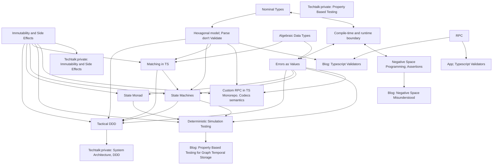

```mermaid
graph TD
    %% context: "what knowledge needed for presenting the concept of...
    TacticalDDD[Tactical DDD]
    StateMonad[State Monad]
    StateMachines[State Machines]
    MatchingTS[Matching in TS]
    ImmutabilitySideEffects[Immutability and Side Effects]
    ParseDontValidate[Hexagonal model; Parse don't Validate]
    NominalTypes[Nominal Types]
    ErrorsAsValues[Errors as Values]
    DST[Deterministic Simulation Testing]
    Codecs[Custom RPC in TS Monorepo. Codecs semantics]
    ADT[Algebraic Data Types]
    CompileRuntimeBoundary[Compile-time and runtime boundary]
    NegativeSpace[Negative Space Programming; Assertions]
    BlogNegativeSpaceMisunderstood[Blog: Negative Space Misunderstood]
    click BlogNegativeSpaceMisunderstood https://www.loskutoff.com/blog/negative-space-is-misunderstood/
    BlogPropertyBasedTestingGraphStorage[Blog: Property Based Testing for Graph Temporal Storage]
    click BlogPropertyBasedTestingGraphStorage https://www.loskutoff.com/blog/graph-property-based/
    BlogTypescriptValidators[Blog: Typescript Validators]
    click BlogTypescriptValidators https://www.loskutoff.com/blog/typescript-validators-jamboree/
    AppTypescriptValidators[App; Typescript Validators]
    click AppTypescriptValidators https://typescript-validators.com/
    TechtalkSystemArchitecture[Techtalk:private: System Architecture, DDD]
    click TechtalkSystemArchitecture https://github.com/dearlordylord/keynote-backups/blob/master/system-architecture-presentation.key
    TechtalkImmutabilitySideEffects[Techtalk:private: Immutability and Side Effects]
    click TechtalkImmutabilitySideEffects https://github.com/dearlordylord/keynote-backups/blob/master/immutability-presentation.key
    TechtalkPropertyBasedTesting[Techtalk:private: Property Based Testing]
    click TechtalkPropertyBasedTesting https://github.com/dearlordylord/keynote-backups/blob/master/property-based-testing.key
    %% unrelated (types are good) https://github.com/dearlordylord/keynote-backups/blob/master/types-presentation.key
    %% unrelated (date-oriented programming) https://github.com/dearlordylord/keynote-backups/blob/master/ECS-bevy-birdseye.key
    %% unrelated (rust GUIs) https://www.loskutoff.com/blog/50-shades-of-rust/
    %% unrelated (WASM) https://monadical.com/posts/wasm-chip8.html
    %% draft (state machines + time is data + xstate) https://docs.google.com/document/d/1zIfB9ZXsBhq4qhmQTuXfW0z-5ovFGXuJjWiqOsPveYw/edit
    %% draft (matching) https://docs.google.com/document/d/10xBMF3k1iZX_5lQwq4uc1rhku8f0uDRHefY1d-MtDsc/edit
    StateMachines-->TacticalDDD
    MatchingTS-->TacticalDDD
    ImmutabilitySideEffects-->TacticalDDD
    ParseDontValidate-->TacticalDDD
    ErrorsAsValues-->TacticalDDD
    ErrorsAsValues-->StateMonad
    ImmutabilitySideEffects-->StateMonad
    MatchingTS-->StateMachines
    ImmutabilitySideEffects-->StateMachines
    ParseDontValidate-->StateMachines
    ErrorsAsValues-->StateMachines
    ADT-->MatchingTS
    ImmutabilitySideEffects-->MatchingTS
    ParseDontValidate-->MatchingTS
    NominalTypes-->ParseDontValidate
    ADT-->ErrorsAsValues
    StateMonad-->DST
    StateMachines-->DST
    ImmutabilitySideEffects-->DST
    ErrorsAsValues-->DST
    ImmutabilitySideEffects-->Codecs
    ParseDontValidate-->Codecs
    ErrorsAsValues-->Codecs
    NominalTypes<-->CompileRuntimeBoundary
    CompileRuntimeBoundary<-->ErrorsAsValues
    CompileRuntimeBoundary<-->NegativeSpace
    NegativeSpace-->BlogNegativeSpaceMisunderstood
    DST-->BlogPropertyBasedTestingGraphStorage
    RPC-->BlogTypescriptValidators
    RPC-->AppTypescriptValidators
    ParseDontValidate-->BlogTypescriptValidators
    TacticalDDD-->TechtalkSystemArchitecture
    ImmutabilitySideEffects-->TechtalkImmutabilitySideEffects
```
